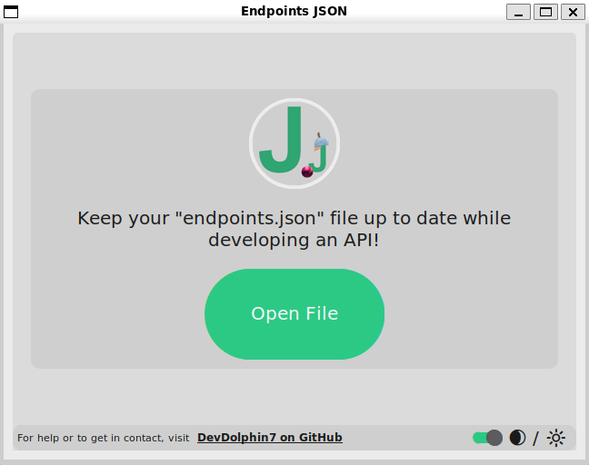
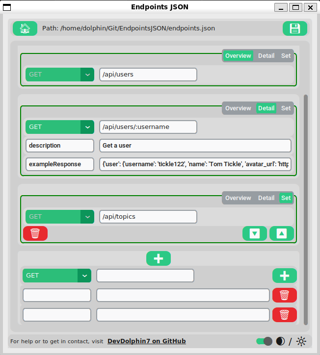
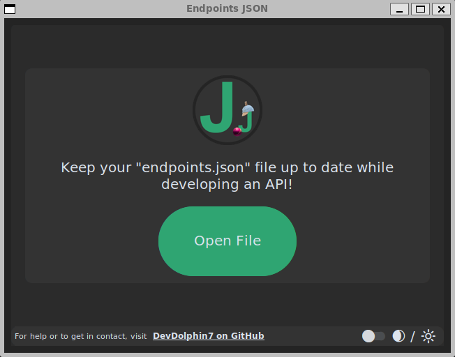
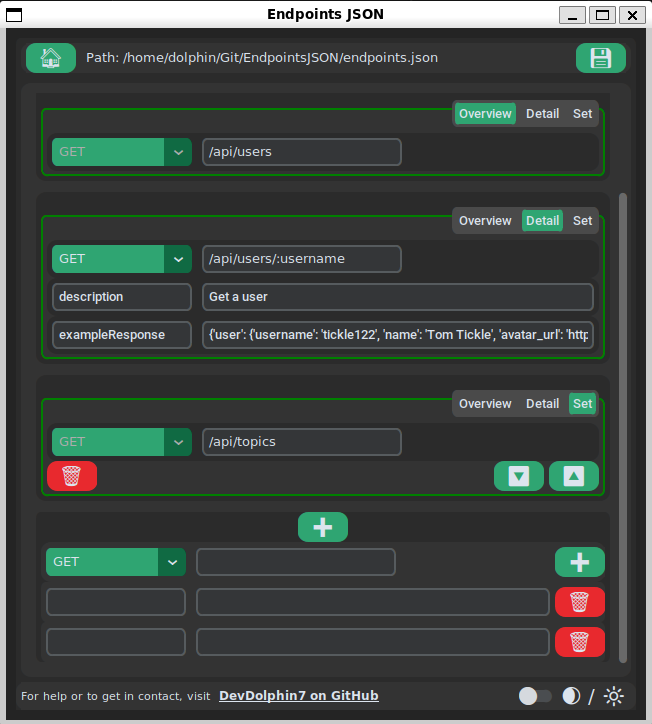

# EndpointsJSON

This app is designed to help you maintain an `endpoints.json` file while developing an API.

Manually having to format the file can be a pain, this app allows you to concentrate on the contents of the file and deals with the formatting for you. It manages formatting for:

-   The HTML method
-   The endpoint path
-   The detailed information for each endpoint
-   The order of the endpoints
-   Removing an endpoint
-   Adding a new endpoint with detailed information

# Images

**_Dark theme is also available:_**  

# Getting Started

## For Everyone

-   `Process TBC`

## For Docker users

-   `Process TBC`

## For Linux / Mac / WSL developers

-   `git clone https://github.com/DevDolphin7/EndpointsJSON.git`
-   `cd ./EndpointsJSON`
-   `./install.sh` <- this script creates a local virtual environment to install the dependencies and locally installs the src module for sibling imports
-   `source .virtual-environment/bin/activate`
-   `python app.py`

You may wish to consider adding the virtual environment to the path of your development environment so the dependencies can be found. [To do this in VS Code:](https://code.visualstudio.com/docs/python/environments):

-   Open the Command Palette 🎨
-   Look for "Python: Select Interpreter" 🐍
-   Select the one that contains ".virtual-environment"

To keep the list of dependencies up to date, it's recommended adding and removing pip packages through `./add-package.sh` and `./remove-package.sh` 🚀

# Support

Feel free to drop me an email on [DevDolphin7@outlook.com](mailto:devdolphin7@outlook.com) or [raise a GitHub issue](https://github.com/DevDolphin7/EndpointsJSON/issues).

This repo is not actively maintained.
